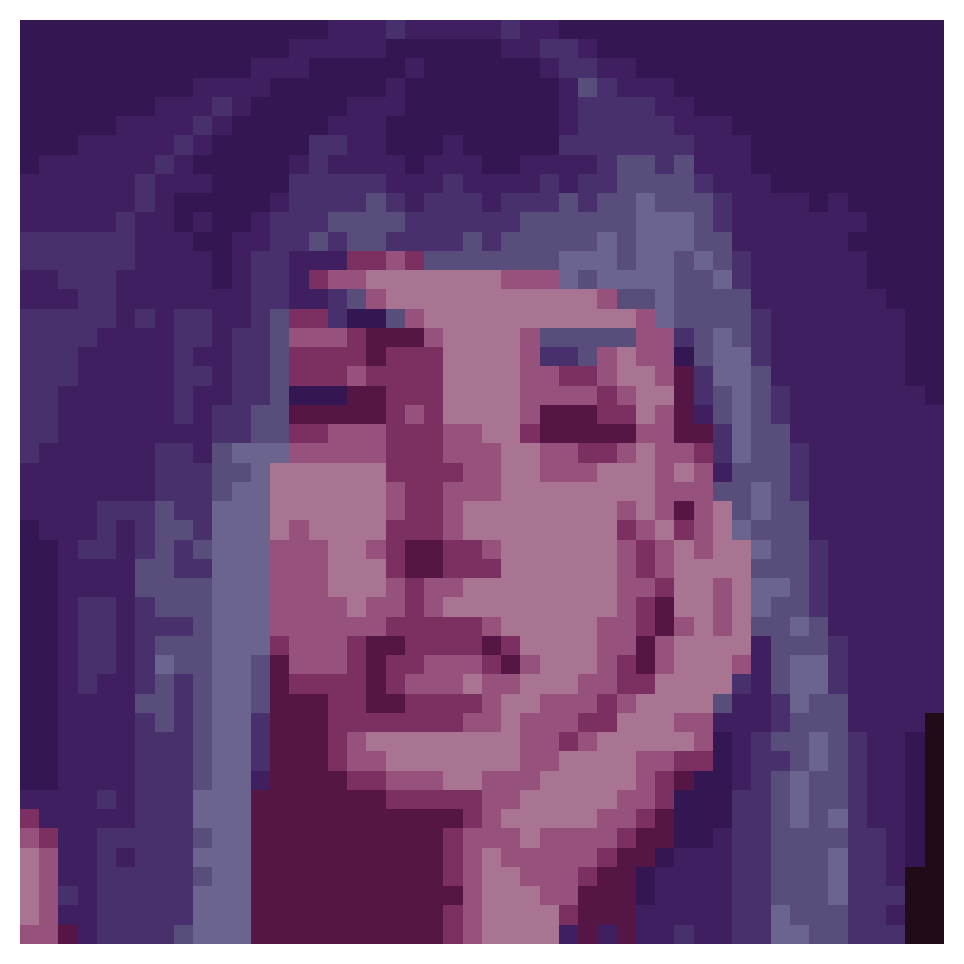

# Pixel Art Generator

This project is a Python-based pixel art generator that processes an input image (preferably of a face), applies edge enhancement, reduces the color palette using K-means clustering, and creates a pixelated version of the image.

## Features
- **Face Detection**: Automatically detects the face in the image using OpenCV's Haar Cascade classifier.
- **Edge Enhancement**: Highlights edges to improve visual clarity in the pixel art.
- **Color Quantization**: Reduces the image color palette to a specified number of colors using K-means clustering.
- **Pixelation**: Divides the image into squares and fills each square with the most frequent color, creating a pixelated effect.

## Project Structure

```
your-repo-name/
│
├── pixel_art.py           # Main script for generating pixel art
├── requirements.txt       # Python dependencies
├── README.md              # Documentation for the project
├── images/                # Folder to store input and output images (optional)
│   ├── input_image.jpg    # Example input image (optional)
│   └── output_image.png   # Example pixel art output (optional)
└── .gitignore             # Ignore unnecessary files in the repo (optional)
```

## Installation

### 1. Clone the Repository
First, clone the repository to your local machine:
```bash
git clone https://github.com/KenanAegean/PixelArt-Maker
.git
cd PixelArt-Maker

```

### 2. Install Dependencies
You can install the required Python dependencies using `pip`:

```bash
pip install -r requirements.txt
```

This will install the following packages:
- `opencv-python`: For image processing and face detection.
- `matplotlib`: For displaying images.
- `scikit-learn`: For color quantization using K-means clustering.

## Usage

To generate pixel art from an image, follow these steps:

### 1. Prepare Your Image
Ensure you have an image you want to convert into pixel art. Place this image in the `images/` folder (or any location of your choice).

### 2. Modify the Script
In the `pixel_art.py` script, update the `image_path` variable with the path to your input image:
```python
image_path = 'images/input_image.jpg'
```

### 3. Run the Script
Run the `pixel_art.py` script to generate the pixel art:

```bash
python pixel_art.py
```

This will display the generated pixel art on your screen.

### 4. Adjust Parameters
You can adjust the following parameters in the `process_image()` function to customize the pixel art:
- **`square_size`**: Controls how large each "pixel" block is. Larger numbers create larger pixel blocks.
- **`num_colors`**: Controls how many distinct colors the pixel art will have. A lower number of colors creates a more simplified, classic pixel art style.

For example:
```python
process_image(image_path, square_size=4, num_colors=10)
```

### Example Usage

```python
# Example of using the process_image function
image_path = 'images/input_image.jpg'
process_image(image_path, square_size=2, num_colors=16)
```

### Output
The pixel art image will be displayed on your screen, and you can also modify the code to save the image using OpenCV's `imwrite()` function if desired.

## Example
Before running the script, you can place an image like this in the `images/` folder:

**Input:**


**Output:**

After running the script, you will get pixel art output similar to this:



## How It Works

1. **Face Detection**: The script detects a face in the input image using OpenCV's Haar Cascade classifier.
2. **Edge Enhancement**: It enhances the edges of the face to make features like eyes, nose, and mouth more pronounced in the pixel art.
3. **Color Quantization**: The color palette is reduced to a set number of colors (e.g., 16 colors) using K-means clustering to simulate the color limitations of classic pixel art.
4. **Pixelation**: The image is divided into square blocks, and the most frequent color in each block is applied, creating the pixelated look.

## Customization

### Edge Enhancement
To adjust the edge enhancement settings, you can modify the thresholds used in the Canny edge detection:
```python
edges = cv2.Canny(blurred, threshold1=80, threshold2=150)
```
Lower values will make the edges more sensitive, and higher values will make them more selective.

### Saving the Output
If you want to save the pixel art to a file instead of displaying it, you can modify the `process_image()` function:
```python
cv2.imwrite('images/output_image.png', pixel_art)
```

## License
This project is licensed under the MIT License. You are free to use, modify, and distribute it.
